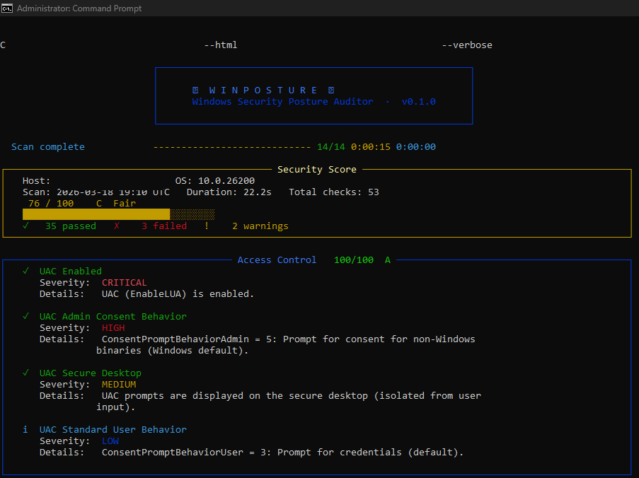
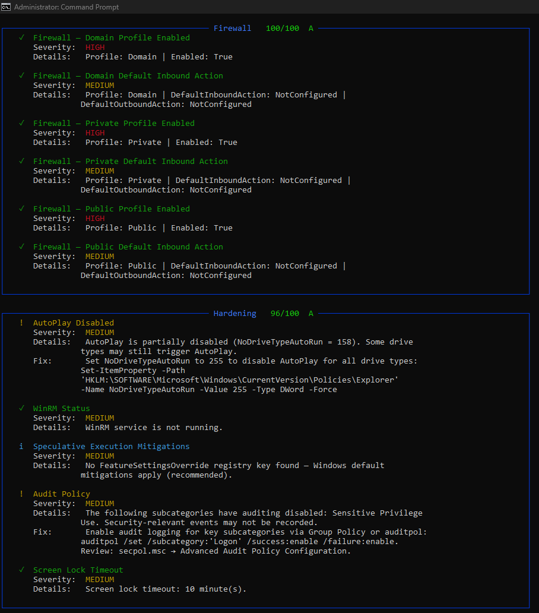
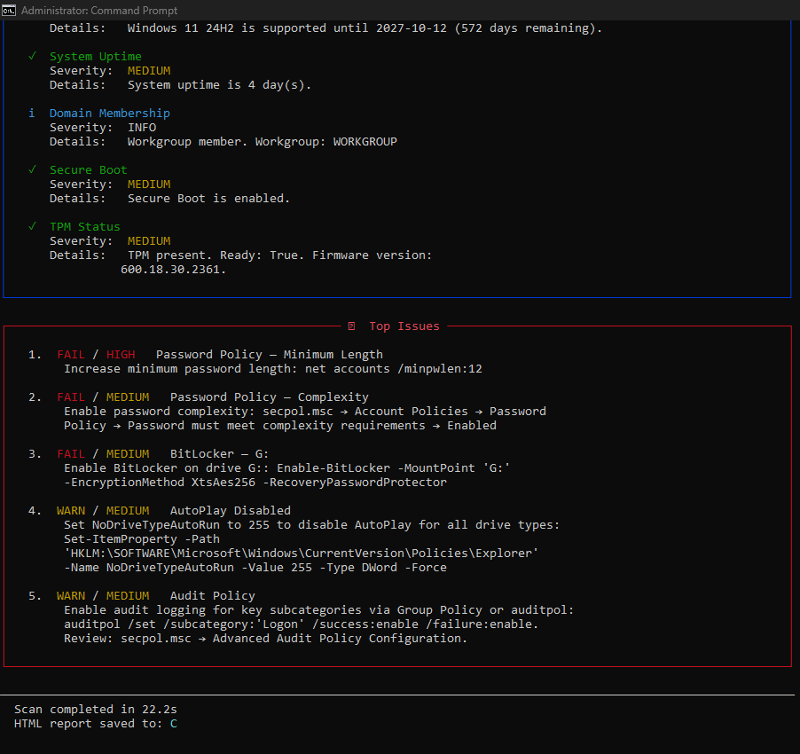

# WinPosture

**Portable Windows security posture auditor.** Runs locally, requires no cloud
connectivity, and produces a scored terminal report and/or self-contained HTML
report of your system's security configuration.

[](https://github.com/hexorcist404/winposture/actions/workflows/test.yml)
[](https://www.python.org/)
[](LICENSE)

---

## Why WinPosture?

Most security auditing tools are either cloud-based (sending your data somewhere),
require expensive licenses, or are complex enterprise platforms. WinPosture is a
single executable you can drop on a USB drive and run on any Windows machine in
seconds — no installation, no internet, no surprises. It gives you an actionable
security score with plain-English remediation advice.

---

## Quick Start — Standalone Executable

No Python required.

1. Download `winposture.exe` from the [Releases](https://github.com/hexorcist404/winposture/releases) page
2. Open a terminal (Command Prompt or PowerShell) **as Administrator** for full results
3. Run:

```
winposture.exe
```

For a full HTML report:

```
winposture.exe --html report.html
```

Then open `report.html` in your browser.

---

## Terminal Output

**Standard scan (default view):**



**Verbose mode (`--verbose`) — full details and remediation steps for every check:**



**Top issues summary (shown at the end of every scan):**



---

## Installation via pip

Requires Python 3.12+ and Windows 10/11 or Server 2019/2022.

```bash
pip install winposture
```

Then run:

```bash
winposture
```

Or from source:

```bash
git clone https://github.com/hexorcist404/winposture.git
cd winposture
pip install -e .
winposture
```

---

## Authorized Use Notice

> **WinPosture is a READ-ONLY auditing tool.**  It does not modify any system
> settings, write to the registry, or make network connections.  All data stays
> on the machine being audited.
>
> **Only run WinPosture on systems you own or have explicit written authorization
> to audit.**  Unauthorized use may violate computer fraud laws in your jurisdiction.

---

## Usage

```
winposture [OPTIONS]

Options:
  --html PATH          Save a self-contained HTML report to PATH
  --json PATH          Save a JSON report to PATH
  --baseline FILE      Save current scan as a JSON baseline for future comparisons
  --compare  FILE      Compare current scan against a saved baseline
  --profile  FILE      Load a custom check profile from a TOML file
  --category CATS      Comma-separated list of categories to audit
                       (e.g. firewall,encryption,patching)
  --dry-run            List check modules that would run without executing them
  --verbose            Show detail for every check, including PASSes
  --no-color           Disable Rich color output (for CI / log files)
  --log-level LEVEL    Logging verbosity: DEBUG, INFO, WARNING (default), ERROR
  --version            Show version and exit
  -h, --help           Show this help message and exit

Exit codes:
  0  Score >= 70 (passing)
  1  Score < 70 (failing)
  2  Fatal scan error
```

### Examples

```bash
# Full audit, terminal only
winposture

# Save HTML report
winposture --html report.html

# Save JSON for automation / SIEM integration
winposture --json report.json

# Audit only firewall and patching
winposture --category firewall,patching

# Show pass/fail details for every check
winposture --verbose

# Silent mode for scripts (exits 0 if score>=70, 1 if score<70, 2 on error)
winposture --no-color --log-level ERROR
echo Exit code: %ERRORLEVEL%

# Save a baseline, then compare on the next run
winposture --baseline baseline.json
winposture --compare  baseline.json

# Apply a custom check profile (e.g. for MSP clients)
winposture --profile myprofile.toml

# List which checks would run without executing anything
winposture --dry-run
```

### Custom Profiles (`winposture.toml`)

Create a `winposture.toml` in your working directory (or pass `--profile FILE`)
to customise scan behaviour:

```toml
[profile]
name = "MSP-Baseline"

[disabled_checks]
# Skip checks irrelevant to this environment
checks = [
    "SMBv1 Disabled",
    "Firewall — Public Default Inbound Action",
]

[severity_overrides]
# Downgrade noisy low-risk checks
"Defender Tamper Protection" = "LOW"

[thresholds]
# Allow 45 days between updates before warning (default: 30)
max_update_age_warn = 45
max_update_age_fail = 90
```

---

## Scoring System

WinPosture calculates a **0–100 security score** by starting at 100 and
deducting points for failed and warned checks, weighted by severity:

| Outcome | Severity | Deduction |
|---------|----------|-----------|
| FAIL    | CRITICAL | -15       |
| FAIL    | HIGH     | -10       |
| FAIL    | MEDIUM   | -5        |
| FAIL    | LOW      | -2        |
| WARN    | CRITICAL | -7        |
| WARN    | HIGH     | -5        |
| WARN    | MEDIUM   | -2        |
| WARN    | LOW      | -1        |

The score is clamped to [0, 100].

**Grade scale:**

| Score  | Grade | Label     |
|--------|-------|-----------|
| 90-100 | A     | Excellent |
| 80-89  | B     | Good      |
| 70-79  | C     | Fair      |
| 60-69  | D     | Poor      |
| 0-59   | F     | Critical  |

INFO and ERROR results do not affect the score.

---

## Checks Performed

| Category   | Check                     | Description                                            |
|------------|---------------------------|--------------------------------------------------------|
| Firewall   | Domain Profile            | Windows Firewall enabled for domain networks           |
| Firewall   | Private Profile           | Windows Firewall enabled for private networks          |
| Firewall   | Public Profile            | Windows Firewall enabled for public networks           |
| Antivirus  | Defender / AV Status      | Real-time protection enabled, signatures current       |
| Patching   | Last Windows Update       | Most recent hotfix installed within 30/60 days         |
| Patching   | Windows Update Service    | wuauserv service is running                            |
| Patching   | Pending Updates           | Count of uninstalled available updates                 |
| Encryption | BitLocker (per drive) *   | BitLocker encryption status for each fixed drive       |
| Accounts   | Local Admin Count         | Number of local administrator accounts                 |
| Accounts   | Guest Account             | Guest account is disabled                              |
| Accounts   | Password Policy           | Minimum password length and complexity                 |
| Services   | Risky Services            | Telnet, SNMP, FTP, and other unnecessary services      |
| Network    | Open Ports                | Unexpected listening ports                             |
| Startup    | Startup Programs          | Unusual entries in startup locations                   |
| SMB        | SMBv1 Protocol *          | SMBv1 disabled (EternalBlue mitigation)                |
| SMB        | SMB Signing *             | SMB signing required (relay attack mitigation)         |
| RDP        | RDP Enabled               | Remote Desktop Protocol state                          |
| RDP        | NLA Enforcement           | Network Level Authentication required for RDP          |
| UAC        | UAC Level                 | User Account Control prompt behavior                   |
| PowerShell | Execution Policy          | Script execution policy (Restricted / AllSigned)       |
| PowerShell | Script Block Logging      | PowerShell script block logging enabled                |
| PowerShell | Constrained Language Mode | Constrained Language Mode active                       |
| OS         | OS Version / Build        | Windows version and patch level                        |
| Hardening  | LLMNR                     | Link-Local Multicast Name Resolution disabled          |
| Hardening  | AutoPlay                  | AutoPlay disabled for removable media                  |
| Hardening  | Remote Registry           | Remote Registry service stopped and disabled           |
| Hardening  | Audit Policy              | Security auditing policies enabled                     |

\* Requires **Administrator** privileges.

---

## Building the Executable

Prerequisites: Python 3.12+, `pip install pyinstaller pillow`

```bash
python build.py
```

The exe will be at `dist/winposture.exe`. To build without the custom icon:

```bash
python build.py --no-icon
```

---

## Contributing

1. Fork the repo and create a branch: `git checkout -b feat/my-change`
2. Make your changes — each check module is self-contained in `src/winposture/checks/`
3. Add or update tests in `tests/`
4. Run `pytest tests/ -q` — all tests must pass
5. Open a pull request into `main`

### Adding a New Check Module

Create `src/winposture/checks/mycheck.py` with:

```python
from winposture.models import CheckResult, Severity, Status

CATEGORY = "MyCategory"
# REQUIRES_ADMIN = True  # uncomment if elevation is needed

def run() -> list[CheckResult]:
    # ... query the system ...
    return [CheckResult(
        category=CATEGORY,
        check_name="My Check Name",
        status=Status.PASS,       # PASS | FAIL | WARN | INFO | ERROR
        severity=Severity.HIGH,   # CRITICAL | HIGH | MEDIUM | LOW | INFO
        description="What this check verifies.",
        details="What was found.",
        remediation="",           # empty string for PASS
    )]
```

The scanner auto-discovers all modules in `checks/` — no registration needed.

---

## License

MIT — see [LICENSE](LICENSE).
